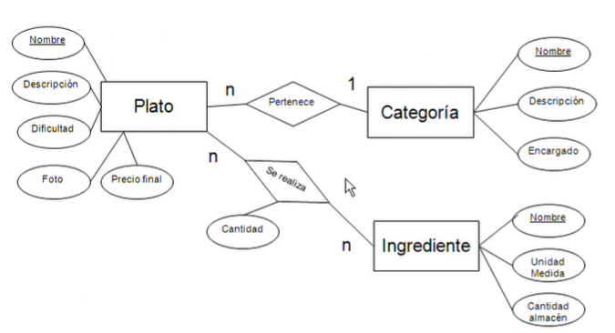

# Diseño lógico de bases de datos

El diseño lógico propone la representación estructurada y detallada de los datos para dar soluciones a problemas. Estas soluciones se tienen que basar en modelos de datos.

## Modelos de bases de datos

Un modelo de base de datos muestra la estructura lógica de la base. El modelo mencionado para resolver el problema es el **modelo relacional**:

* Ordena los datos en tablas que se conocen como **“relaciones”**.
* Se pueden establecer relaciones entre los datos de las tablas.
* Indica cómo se van a convertir los atributos clave en el esquema lógico como **clave principal**.

---

Con el diseño lógico podemos visualizar las tablas que van a dar solución al problema basándonos en las siguientes reglas:

* **Relación N:N (Muchos a Muchos):** Se modela en una **tabla nueva**.
* **Relación 1:N (Uno a Muchos):** Se incluye la clave en la **tabla de cardinalidad N**.
  
# Resolución de Problemas: Diseño de Bases de Datos

## 1. Problema de Datos

Se desea construir una base de datos que almacene la carta de un restaurante. Para cada plato, se desea obtener su nombre, descripción, nivel de dificultad (de elaboración), una foto y el precio final para el cliente. Cada plato pertenece a una categoría. Las categorías se caracterizan por su nombre, una breve descripción y el nombre del encargado. Además de los platos, se desea conocer las recetas para su realización, con la lista de ingredientes necesarios, aportando la cantidad requerida, las unidades de medida (gramos, litros, etc...) y cantidad actual en el almacén.

---

## 2. Diagrama Entidad - Relación (DER)

---

## 3. Lógica de Transformación de Relaciones

Para convertir el diagrama en tablas reales, aplicamos las siguientes reglas de cardinalidad:

### Relación N:M (Muchos a Muchos) → Creación de una nueva tabla

Para gestionar la relación entre los platos y sus ingredientes (recetas), se utiliza la tabla intermedia **SE_REALIZA**.

**SE_REALIZA** (Nombre_plato, Nombre_ingrediente, cantidad)

* **CP:** Nombre_plato, Nombre_ingrediente
* **CAj:** Nombre_plato → **PLATO** (Nombre)
* **CAj:** Nombre_ingrediente → **INGREDIENTE** (Nombre)

### Relación 1:N (Uno a Muchos) → Se incluye en la cardinalidad N

**PLATO** (Nombre, Descripción, Dificultad, Foto, Precio final)
* **CP:** Nombre

**CATEGORIA** (Nombre, Descripción, Encargado)
* **CP:** Nombre
 
**INGREDIENTE** (Nombre, Unidad Medida, Cantidad Almacen)
* **CP:** Nombre
  
### →

**PLATO** (Nombre, Descripción, Dificultad, Foto, Precio final, Nombre_categoria)
* **CP:** Nombre
* **CAj:** Nombre_categoria → CATEGORIA(Nombre)

---
---
